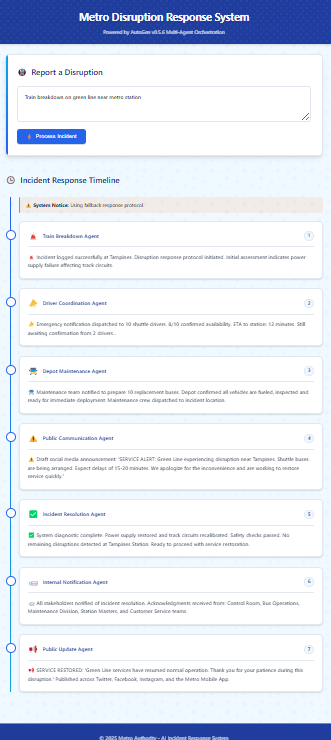

# 🚇 Metro Disruption Response System

## 📌 Overview

The **Metro Disruption Response System** is an AI-powered incident management platform designed to efficiently orchestrate coordinated responses to metro service disruptions. Leveraging **AutoGen v0.5.6** and multi-agent technology, the platform simulates real-time response workflows with specialized agents managing distinct aspects of incident handling.

---

## 🌟 Features

- **Multi-Agent Orchestration**: Utilizes seven specialized agents, each managing specific roles within the complete incident lifecycle.
- **Real-time Response Simulation**: Clearly visualizes the sequential steps involved in incident management workflows.
- **Fallback Mechanisms**: Robust handling ensures the system remains operational, even during LLM service disruptions.
- **Professional UI**: Provides a modern, transit-inspired interface, including smooth animations and responsive design.
- **API Backend**: Offers FastAPI-based endpoints with comprehensive error handling for reliable incident processing.

---

## 🏗️ Architecture

### 🎨 Frontend

- Modern, responsive web interface built with **HTML**, **CSS**, and **vanilla JavaScript**.
- Animated sequential display, presenting agent responses with a 1.5-second delay.
- Transit-themed timeline-based UI.
- Graceful fallback to mock data if API services become unavailable.

### 🚧 Backend

- **FastAPI** application hosting both the UI and REST API endpoints.
- Incident orchestration via **AutoGen v0.5.6** multi-agent framework.
- Integration with **Azure OpenAI**, including fallback to `MockModelClient` for maximum resilience.

---

## 🤖 Specialized Agents

The system orchestrates seven sequentially executed specialized agents:

| Agent                             | Responsibility                                      |
| --------------------------------- | --------------------------------------------------- |
| 🚨 **Train Breakdown Agent**      | Detects and logs the initial incident.              |
| 📣 **Driver Coordination Agent**  | Notifies bus drivers to report to the depot.        |
| 🚍 **Depot Maintenance Agent**    | Ensures buses are ready for immediate deployment.   |
| ⚠️ **Public Communication Agent** | Drafts disruption notices for social media.         |
| ✅ **Incident Resolution Agent**  | Verifies resolution and service restoration.        |
| 📨 **Internal Notification Agent** | Notifies relevant internal stakeholders.            |
| 📢 **Public Update Agent**        | Publishes the final restoration message publicly.   |

---

## 🛠️ Setup

### 🔗 Prerequisites

- **Python 3.10 or higher**
- Access to **Azure OpenAI API** *(or alternatively use `MockModelClient`)*

### 📥 Installation

1. Clone this repository:

```
git clone <repository_url>
cd <repository_name>
```

2. Install dependencies:

```
pip install -r requirements.txt
```

3. Configure environment variables (`.env` file):

```
# Azure OpenAI Configuration
AZURE_OPENAI_ENDPOINT=your_azure_endpoint
AZURE_OPENAI_API_KEY=your_api_key
AZURE_OPENAI_DEPLOYMENT_NAME=your_deployment_name
AZURE_OPENAI_MODEL_NAME=gpt-4o
AZURE_OPENAI_API_VERSION=2024-02-01
```

### 🚀 Running the Application

Start the FastAPI backend server:

```
cd app
uvicorn main:app --reload
```

Access the frontend:

```
http://localhost:8000
```

---

## 🎯 Usage

1. Enter a disruption scenario in the provided input box.  
   **Example:**  
   ```
   Train breakdown on green line near Tampines station
   ```

2. Click **"Process Incident"**.

3. Observe the step-by-step responses as each specialized agent sequentially resolves the incident.

4. Review the generated timeline illustrating the complete incident workflow.

---

## 🧑‍💻 Development

- **Add New Agents:**  
  Create a new agent Python file within the `agents/` directory following existing patterns.

- **Add New Tools:**  
  Create new tool function Python files in the `tools/` directory.

- **Modify UI:**  
  Adjust the frontend by updating `index.html` and files located in the `static/` directory.

---

## 📚 Technical Details

- Built upon **AutoGen v0.5.6** multi-agent orchestration framework.
- Intelligent agents powered by **Azure OpenAI** with seamless fallback to `MockModelClient`.
- Utilizes `RoundRobinGroupChat` for orderly sequencing of agent responses.
- Implements the `FunctionTool` pattern for extensible agent capabilities.

---

## RESULT:



🎉 **Enjoy efficient and seamless metro disruption management!** 🚇

